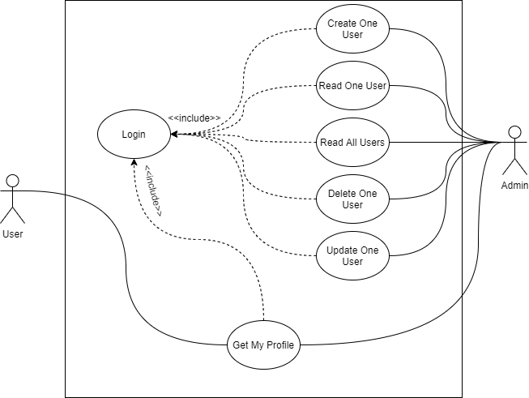

# Node Docker Kubernetes

Sample application to demonstrate how to implement a simple API with Node.js, Docker, and Kubernetes. This application is live in case you want to test things out.

## Useful Links

- [API Documentation](https://documenter.getpostman.com/view/15712851/TzRSfSqD) in Postman is available here.
- [Click me](https://ndk-api.herokuapp.com/) to access the live version of the API. Be warned as this is deployed on Heroku, there is no Kubernetes / GKE at play here. I intentionally made this so people can test things out faster.
- [DockerHub](https://hub.docker.com/r/lauslim12/node-docker-kubernetes) to access the docker image repository.

## Requirements

- Node.js version 14 and up
- NPM version 6 and up
- MongoDB (I use MongoDB Atlas)
- Docker
- Kubernetes (I use `Minikube` to deploy the app locally)
- Postman (at least the Desktop User Agent if you want to test the API route without using `curl`)

## Features

This is a bare API that is equipped with several features.

- Two user authentications: `admin` and `user`. Authentication is done via JWT.
- An administrator can perform CRUD operations on each users. Passwords are encrypted with asynchronous BCRYPT.
- A user can only see their own profile.
- Code is documented properly and according to JSDoc's minimum standards.
- Application is documented properly (diagrams and Postman API documentation exist for quick skimming).

## Use Case

Following is the use-case diagram for the application.



## Installation

To install the application, do the following steps.

Clone the repository.

```bash
git clone https://github.com/lauslim12/node-docker-kubernetes.git
```

Install the application.

```bash
npm install
```

Fill environment variables first. Rename `.env.example` to `.env` and fill the `DATABASE` environment variable with your MongoDB connection string. Make sure to use the complete connection string.

```bash
mv .env.example .env
nano .env
```

Migrate the sample data first.

```bash
npm run migrate
```

Run the application in development mode.

```bash
npm run dev
```

If you want to run the application in production mode.

```bash
npm start
```

If you want to test with an administrator account, you can login with the following credentials:

```bash
username: sayu
password: 123
```

Check for the API documentation in Postman. **Make sure to use the production or development environment in Postman!**

## Deployment

We will deploy the application on Docker so it could be deterministic.

Containerize the application first.

```bash
docker build . -t node-docker-kubernetes
```

Check if it has been successfully built.

```bash
docker images
```

Test the application locally. The `ndk` stands for `node-docker-kubernetes`.

```bash
docker run -it --name ndk -p 3000:3000 --env-file=./.env node-docker-kubernetes
```

List your application in your local machine.

```bash
docker ps
```

Stop Docker after you have finished testing.

```bash
docker stop
docker rm
```

Note that you might need to also deploy your MongoDB to Kubernetes and Docker if you are using this locally. Because I use MongoDB Atlas (cloud database-as-a-service), I don't deploy it in this repository.

By the way, I have already deployed this Docker image on my Docker Hub. If you're too lazy to create it, feel free to just pull it from my Docker Hub and test it on your local machine.

```bash
docker pull lauslim12/node-docker-kubernetes
```

Another alternative, you can use `docker-compose`.

```bash
docker-compose up
```

## Scaling

Then, after creating our Docker image, we will scale it infinitely with Kubernetes.

Start Minikube (Best practice is to use Docker as the virtual machine).

```bash
minikube start --docker
```

Generate Kubernetes secret file first, so that we can use our environment variables from the `.env` file.

```bash
kubectl create secret generic prod-secrets --from-env-file=.env
```

Run Kubernetes deployment scripts. To be warned, I set the `kubernetes/deployment.yml` file to pull from my Docker Hub. You might need to make your own adjustments if you want to use your own image.

```bash
kubectl apply -f kubernetes
```

Check if the application has been deployed to Kubernetes.

```bash
kubectl get pods --watch
```

Access your application.

```bash
minikube service ndk --url
```

Scale infinitely.

```bash
kubectl scale --replicas=10 deployment.apps/node-docker-kubernetes-deployment
kubectl get pods -l app=ndk --watch
```

Clean up your application and stop Minikube.

```bash
kubectl delete -f kubernetes
minikube stop
```

## Development

Don't forget to run the linters to make the code better!

```bash
npm run lint
```
